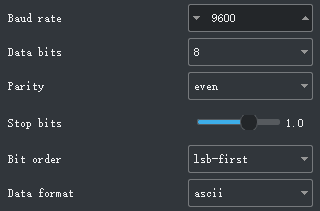

https://www.studio1productions.com/Articles/sony-pinout.htm
http://peterwedege.blogspot.com/2016/01/analyzing-sonys-new-multiport-protocol.html

# Sony MultiPort Remote Protocol
- Analyzed on ILCE-7M3 with thirdparty remote (JJC SR-F2W) with fx2lafw and sigrok PulseView.

- The protocol is standard 3.3V UART protocol with 
    - 9600 bps baudrate
    - 8 data bit
    - 1 stop bit
    - EVEN parity
    - LSB first layout

- Begin with a symbol [#, $, %, &], then some digits, ends with `*`

    - \# (Remote -> Camera) Command
    - $ (Camera -> Remote) Command ACK
    - % (Camera -> Remote) Unsolicited Message?
    - & (Remote -> Camera) Unsolicited Message ACK?

## Power on
- (Press **Power** button)
- [Remote] (Pull Pin1 of multiport low for 200ms)
- [Camera] `%000*`
- (After 55ms)
- [Camera] `%000*`
- [Remote] `&00080*`

## Focus
- (Press **Focus** button, i.e. press shutter button lightly)
- [Remote] `#7200*`
- [Camera] `$72000*`
- (Release **Focus** button)
- [Remote] `#7210*`
- [Camera] `$72100*`

## Shutter
- (Press **Shutter** button, i.e. press shutter button firmly)
- [Remote] `#7300*`
- [Camera] `$73000*`
- (Release **Shutter** button)
- [Remote] `#7310*`
- [Camera] `$73100*`

## Grid line
- (Press **Grid Line** button)
- [Remote] `#7000*`
- [Camera] `$70000*`
- (Release **Grid Line** button)
- [Remote] `#7010*`
- [Camera] `$70100*`

## Video Record
- (Press **Video Record** button)
- [Remote] `#7100*`
- [Camera] `$71000*`
- (Release **Video Record** button)
- [Remote] `#7110*`
- [Camera] `$71100*`
    ### **Unsolicited message during recording start and finish?**
    - [Camera] `%7610*`
    - [Remote] `&76100*`
    - [Camera] `%7600*`
    - [Remote] `&76000*`

## Zoom
- (Press **Zoom-W** button lightly)
- [Remote] `#7510*`
- [Camera] `$75100*`
- (Press **Zoom-W** button firmly)
- [Remote] `#7570*`
- [Camera] `$75700*`
- (Release **Zoom-W** button)
- [Remote] `#7590*`
- [Camera] `$75900*`
- (Press **Zoom-T** button lightly)
- [Remote] `#7410*`
- [Camera] `$74100*`
- (Press **Zoom-T** button firmly)
- [Remote] `#7470*`
- [Camera] `$74700*`
- (Release **Zoom-T** button)
- [Remote] `#7590*`
- [Camera] `$75900*`

